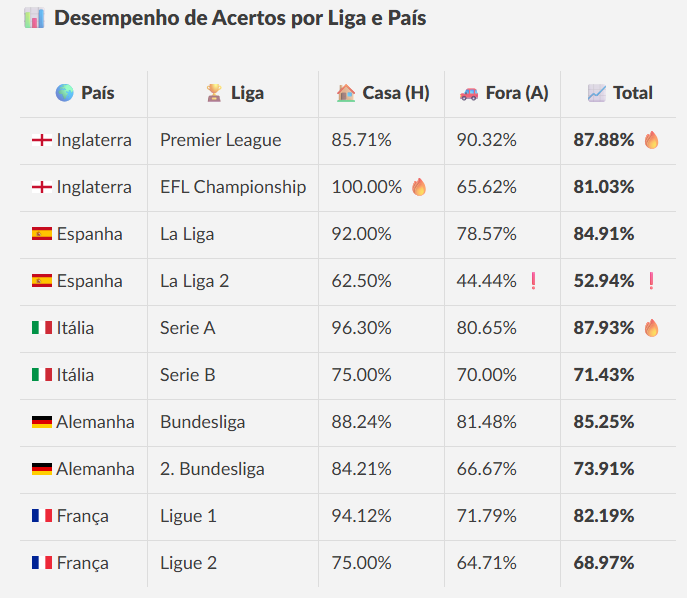

### 📊 Desempenho de Acertos por Liga e País

| 🌍 País             | 🏆 Liga              | 🏠 Casa (H)   | 🚗 Fora (A)   | 📈 Total     |
|---------------------|----------------------|----------------|----------------|----------------|
|  Inglaterra       | Premier League       | 85.71%         | 90.32%         | **87.88%** 🔥     |
|  Inglaterra       | EFL Championship     | 100.00% 🔥        | 65.62%         | **81.03%**     |
|  Espanha          | La Liga              | 92.00%         | 78.57%         | **84.91%**     |
|  Espanha          | La Liga 2            | 62.50%         | 44.44% ❗        | **52.94%** ❗    |
|  Itália           | Serie A              | 96.30%         | 80.65%         | **87.93%** 🔥   |
|  Itália           | Serie B              | 75.00%         | 70.00%         | **71.43%**     |
|  Alemanha         | Bundesliga           | 88.24%         | 81.48%         | **85.25%**     |
|  Alemanha         | 2. Bundesliga        | 84.21%         | 66.67%         | **73.91%**     |
|  França           | Ligue 1              | 94.12%         | 71.79%         | **82.19%**     |
|  França           | Ligue 2              | 75.00%         | 64.71%         | **68.97%**     |
